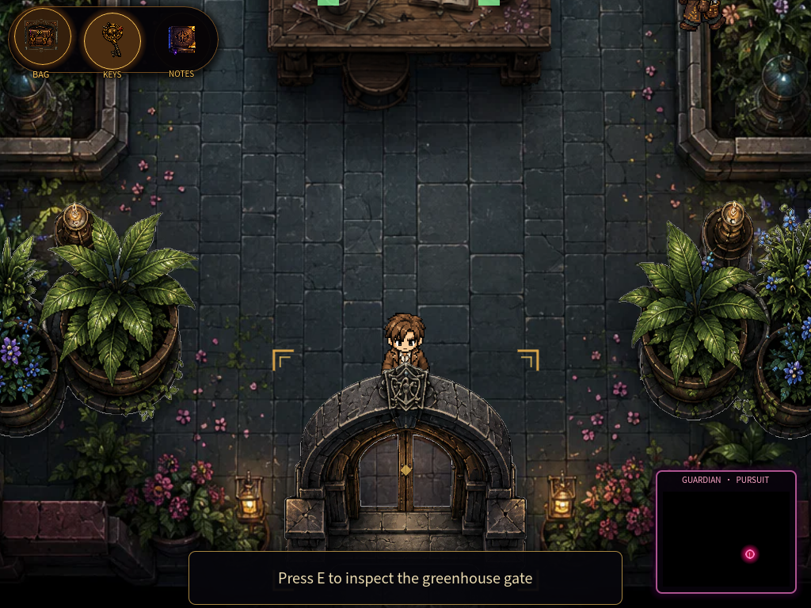
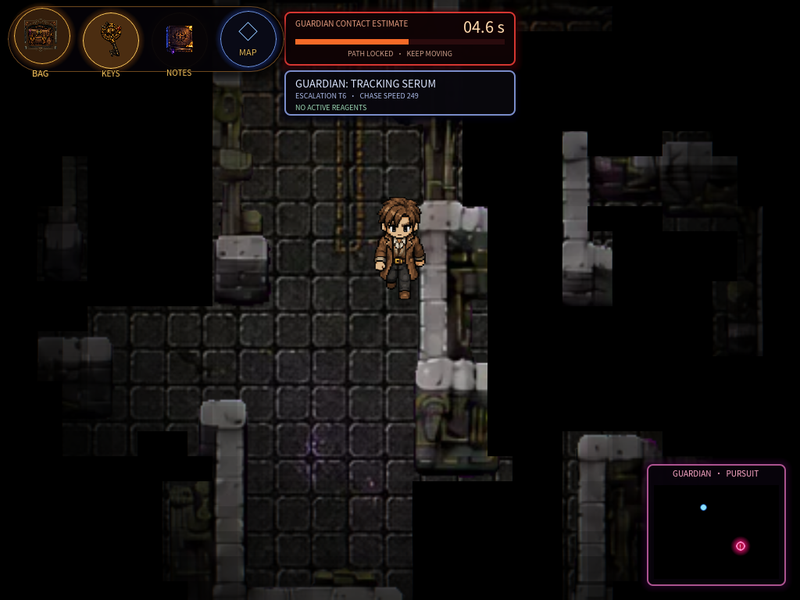
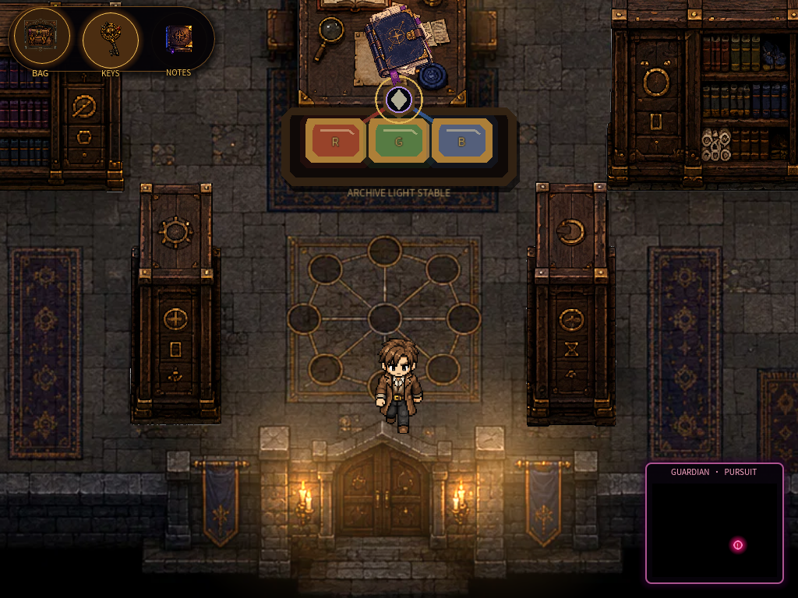

# Shadow Castle: STEM Detective

[](https://play.shadowcastledetective.com/)


A 2D pixel-art detective game about a blackout at a magical castle. You gather
evidence, tell a lead apart from proof, solve locks that turn on real science,
test each suspect's alibi, and name the culprit — while something hunts you
through the dark between rooms.

一款以「城堡停电之夜」为舞台的 2D 像素侦探游戏。你需要收集证据、分辨线索与
实证、解开建立在真实科学原理上的门锁、检验每位嫌疑人的不在场证明，最终指认
真凶 —— 而在房间之间的黑暗里，有东西正在追捕你。

**▶ [Play in your browser](https://play.shadowcastledetective.com/)** — no install.
Progress saves locally; an optional account carries a run across devices.

| Greenhouse | Castle Hall under pursuit | Library optics lab |
| --- | --- | --- |
|  |  |  |
| Segmented herb plots that regrow on a clock | Contact estimate, escalation tier, fog-limited sight | RGB filters feeding the archive layer |

---

## Contents

[Design goal](#design-goal) ·
[Systems](#systems) ·
[Technology](#technology) ·
[Testing](#testing) ·
[Run locally](#run-locally) ·
[Structure](#project-structure) ·
[Documentation](#documentation)

---

## Design goal

Clues are not collectibles. The player has to reason: a lead is not proof, an
alibi has to survive a timeline, and a locked door opens because you understood
the science behind it — not because you found the right key sprite.

The science is load-bearing rather than decorative. Chemical versus physical
change decides which evidence matters. Photosynthesis inputs gate a greenhouse
supply. Conductors and broken circuits are what restore the castle's power.
Additive colour mixing is what reveals a hidden archive layer.

线索不是收藏品。玩家必须真正推理：线索不等于实证，不在场证明必须经得起时间线
检验，而一道门之所以打开，是因为你理解了它背后的科学 —— 不是因为你捡到了对的
钥匙贴图。

## Systems

- **Investigation loop** — evidence board, notes, objectives, and a final
  accusation that can be right for the wrong reasons.
- **The Guardian** — a two-phase hunter. While a tracking serum runs in your
  blood it finds you anywhere and gains 12% speed per recovered key. Brew the
  Purification Potion and it falls back to a real sight cone, stakes out the
  doorway you are heading for, and can be answered with Daze and Shroud.
- **Power-gated exploration** — before the generator is restored, walls and
  walked routes vanish into black outside your flashlight. Afterward, ground you
  have walked becomes persistent grey memory.
- **A renewable greenhouse** — ten segmented harvest points across four
  plantings, each growing its own herb on a real-time regrowth clock, feeding
  refining recipes that convert herbs into every reagent the potion list needs.
- **A guided opening that never stops the game** — a six-step first lead, then a
  Hall crossing paced to stay survivable whether you sprint or read every label,
  ending on a scripted near-miss at the Chemistry door.
- **Five rooms of STEM locks** — alchemy, pollen evidence, an electrical repair
  sequence, timeline reasoning, and a three-stage optics laboratory.

<details>
<summary><b>Full feature list</b></summary>

- Top-down castle exploration with click-to-move, A* pathfinding and camera follow.
- A chase system with physical collision and a checkpoint/retry loop.
- Investigation rooms for chemistry, biology, circuits, archives, dining, and the
  final deduction.
- A unified detective field kit with four task-specific Hubs: Bag files everything
  under four authored tabs (All, Potions, Materials, Papers), while Key, Note and
  Map act as lock register, dossier reader and tactical survey table.
- A staged Circuit-restoration milestone with generator impact, workshop light
  flicker, synthesized electrical audio, progressive Hall route scanning, and an
  immediate Map reward.
- Measured pre-Circuit pacing on the real A* route: three safe-room-separated
  darkness exposures and at least 4.32 seconds of Hall-return reaction at Tier 2
  Guardian escalation.
- Five animated pixel NPCs: Dr. Lin, Butler, Gardener, Mechanic, Castle Guardian.
- A two-layer finale: an ordinary case against the Butler, followed by optional
  sealed-archive review that exposes the Mechanic's forged command chain.
- A manual alchemy interaction: three player-loaded material nodes, a violet
  stabilizer core, non-destructive error feedback, and a brass extraction lever.
- A Library optics laboratory: read three knowledge records from distant shelves,
  clear three five-stage light games — prism dispersion ordering, pigment
  reflection/absorption, additive colour mixing — then insert the earned RGB
  filters to reveal the archive layer.
- Dialogue, evidence board, notes, maps, objective panel, inventory, checkpoint
  and main-menu flows.

</details>

## Technology

| | |
| --- | --- |
| **Engine** | Godot 4.7 |
| **Language** | GDScript, ~51k lines |
| **Format** | 2D pixel art, 1024 × 768 viewport |
| **Web build** | Single-threaded WebAssembly export with a custom loading shell. A service worker hands new versions to the game instead of reloading the page underfoot — the player is asked, and a checkpoint is saved before any restart. |
| **Cloud saves** | Optional accounts on serverless functions and private blob storage, using salted scrypt hashing, per-IP and per-account rate limiting, and revision checks so a stale device cannot overwrite newer progress. |

## Testing

Gameplay is covered by **38 headless regression suites** that drive the real
scenes rather than mocks — the chase suite instantiates the Hall, runs the
Guardian, and asserts on what a player would actually experience.

```bash
# Any suite; the exit code reports pass/fail.
godot --headless --path . --script res://tests/potion_economy_test.gd
```

Several suites exist to protect design guarantees that regress silently:

| Suite | Guarantee |
| --- | --- |
| `guardian_tutorial_chase_test.gd` | The guided first crossing stays survivable at any pace and still ends on a near-miss. |
| `potion_economy_test.gd` | Every potion is reachable from renewable input — it crafts the whole list, refining reagents on demand. |
| `panel_overflow_test.gd` | No panel draws text outside its own frame, measured against font extents rather than control rects. |
| `interaction_stops_walk_test.gd` | Interacting always halts a click-move, so the character never walks off on its own. |
| `developer_mode_test.gd` | The developer clear credits every stage to the room, and stays hidden for normal players. |
| `hall_route_authoring_test.gd` | The tutorial follows the route the author walked, and still falls back to pathfinding without one. |
| `room_spatial_audit.gd` | Every interactable is reachable from walkable floor. |

### Developer mode

Reaching a late-game bug used to mean solving eight minigame stages by hand
first. Pressing **`0`** toggles developer mode from any room; while it is on, each
minigame panel shows a clear button that settles the game as a full clear.

The room receives exactly the values a real clear sends, so rewards, story
flags and the checkpoint all fire normally — only the manual solving is
skipped. The mode is session-only, defaults off, and is never written to a
save, so the button cannot appear for a player.

Turning developer mode on inside the Hall also records the walk. Reaching
the Chemistry door writes it to `data/hall_tutorial_route.json`, and the
tutorial follows that line instead of a pathfound one — a taught route is a
design decision, not a pathfinding result.

[`docs/MINIGAME_ANSWERS.md`](docs/MINIGAME_ANSWERS.md) lists every stage's
answer. It is generated, not written by hand: each entry is computed from the
games' own constants and re-verified against their own judging functions, and
the generator refuses to write the file if any check fails.

```bash
godot --headless --path . --script tools/generate_minigame_answers.gd
```

## Run locally

```bash
git clone https://github.com/s-ccao/shadow-castle-stem-detective.git
```

1. Install Godot 4.7 (or a compatible Godot 4 release).
2. Import [`project.godot`](project.godot) in the Godot Project Manager.
3. Press `F5` to run.

## Project structure

| Folder | Purpose |
| --- | --- |
| `scenes/` | Godot scenes for the castle, rooms, UI, player and Guardian. |
| `scripts/` | Gameplay, room logic, HUD systems, interactions, NPC animation. |
| `autoload/` | Persistent game state, save/checkpoint logic, cloud sync, localization. |
| `assets/` | Character sheets, portraits, room backgrounds, props, UI, navigation data. |
| `tests/` | Headless regression suites and visual capture scripts. |
| `docs/` | Development history, art process, and portfolio documentation. |

## Documentation

- [Design paper](docs/PAPER.md) — the instructional argument behind the game: why scientific reasoning is the progression mechanic, how the finale separates a lead from proof, and how pedagogical guarantees are held in place by tests.
- [Project status](docs/PROJECT_STATUS.md) — current phase, implemented flow, acceptance focus.
- [Development history](docs/DEVELOPMENT_HISTORY.md) — versioned milestones with technical decisions and evidence.
- [Agent handoff](docs/AGENT_HANDOFF.md) — system map, safeguards, validation flow, next priorities.
- [Minigame answers](docs/MINIGAME_ANSWERS.md) — every stage of all six minigames with the rule it teaches; generated from the games' own logic and verified against their own judging functions.
- [Character art pipeline](docs/ART_PIPELINE.md) — the three visual passes, why an early concept was rejected, and how the final sheets were imported.

## Attribution

The final NPC images were generated as art-directed source material, then
reviewed, selected, made transparent, arranged into gameplay sprite sheets and
integrated in Godot. The process is documented in full in
[the character art pipeline](docs/ART_PIPELINE.md).
